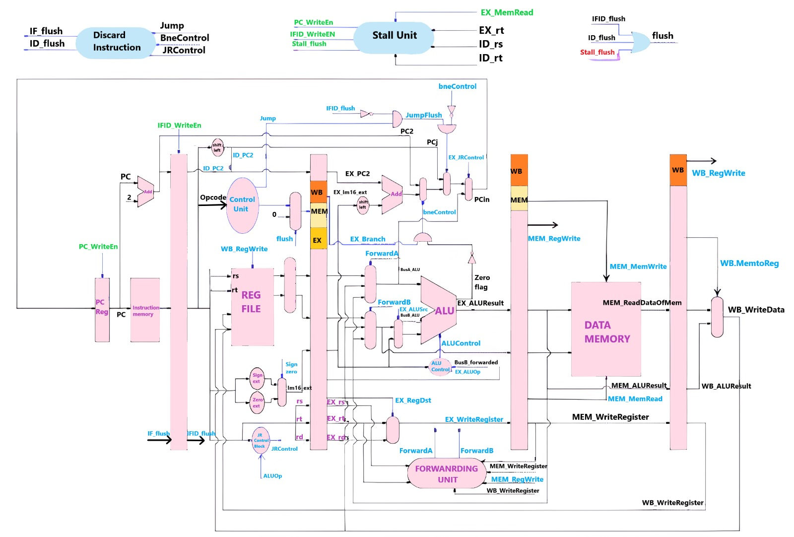
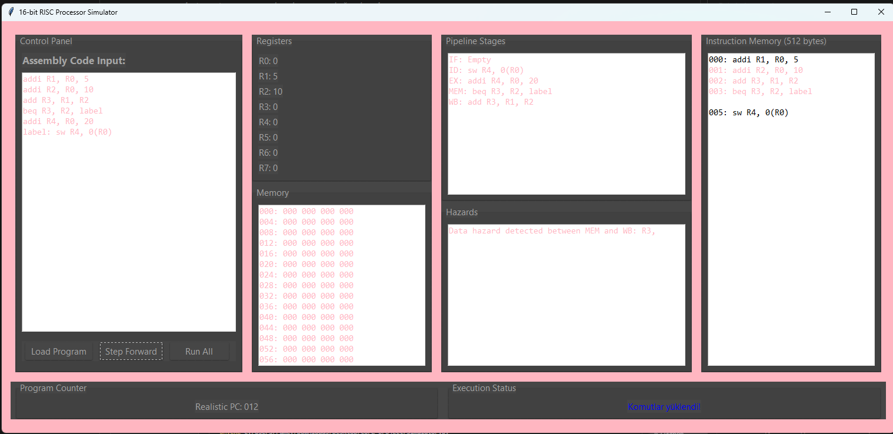

# 16-bit-RISC-Processor
A Python-based 16-bit RISC Processor Simulator with GUI interface. This simulator provides an educational platform for understanding processor architecture, pipeline stages, and assembly programming through a user-friendly graphical interface.

## Key Features
- **16-bit RISC Architecture**
  - 8 general-purpose registers (R0 - R7)
  - 512-byte byte-addressable memory
  - 512-byte instruction memory
  - Program Counter (PC) with accurate tracking

- **Interactive GUI**
  - Assembly code editor and loader
  - Step-by-step execution control
  - Real-time visualization of:
    - Register contents
    - Memory state
    - Pipeline stages
    - Hazard detection

- **Pipeline Implementation**
  - Complete 5-stage pipeline:
    - Instruction Fetch (IF)
    - Instruction Decode (ID)
    - Execute (EX)
    - Memory Access (MEM)
    - Write Back (WB)
  - Hazard detection and handling:
    - Data hazards
    - Control hazards

- **Comprehensive Instruction Set**
  - **R-Type Instructions:** add, sub, and, or, slt, sll, srl
  - **I-Type Instructions:** addi, lw, sw, beq, bne
  - **J-Type Instructions:** j, jal, jr

- **Debug Features**
  - Real-time error detection
  - Invalid instruction alerts
  - Memory access violation warnings
  - Pipeline state monitoring

## System Requirements
- Python 
- Required Libraries:
  - tkinter (GUI framework)
  - ttkthemes (GUI styling)

## Installation

1. Clone the repository:
https://github.com/rumeysa111/16-bit-risc-processor.git
```

2. Install dependencies:
```bash
pip install ttkthemes
```

3. Launch the simulator:
```bash
python simulator.py
```

## Usage Guide
1. Start the application to open the GUI interface
2. Load or write assembly code in the code editor
3. Click "Load Program" to assemble the code
4. Execute the program using:
   - "Step Forward" for instruction-by-instruction execution
   - "Run All" for complete program execution
5. Monitor processor state in real-time through the GUI panels

## Project Structure
- `simulator.py`: Main application and GUI implementation
- `16_bit_processor.circ`: Circuit design file
- Additional support files for processor implementation

## Contributing
Contributions are welcome! Please feel free to submit pull requests, report bugs, or suggest features.

## Architecture Design
### Datapath Design

*Figure 1: Detailed datapath design of the 16-bit RISC processor*

## Screenshots

*Figure 2: GUI interface of the simulator*

